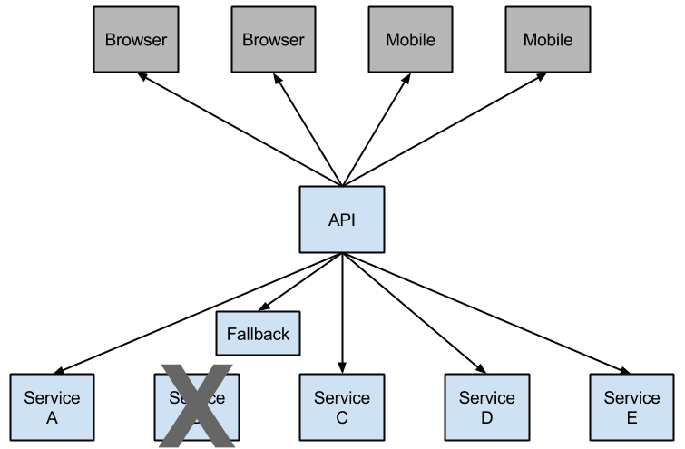

微服务之构建容错&自动降级的系统 
----------
###微服务之后，前端（Web、App）怎么开发？
以电商APP为例，需要购物车、物流服务、商品服务、推荐服务、订单服务、评价服务、类目服务....

如果我们让APP分别去调用这些服务会带来什么后果？
- 后端代码必须改造，因为APP调不了Dubbo协议（好复杂），我们得给每个服务都架设一个HTTP代理，也无法利用MicroService的服务发现机制（其实就是连不上Zookeeper），必须通过额外的nginx做负载均衡
- 客户端的代码极其冗余，因为业务是需要融合的，很多页面需要发送多次请求才能返回给用户一个完成的View，特别是还有前后关联的调用，在APP上面用callback很不爽
- 将内部的逻辑放到了客户端，一旦服务有拆分、融合之类的操作，APP也必须升级
###适配移动化的BFF架构
在微服务和APP之间建立一个沟通的桥梁，一个网关（Gateway），我们称之为<strong>Backend for Fronter</strong>，一个专为前端准备的后端（绕口令中）

BFF职责是路由、聚合、协议转换。
每个请求BFF都可能会调用后面多个微服务的Dubbo接口，将结果聚合后返回给前台。BFF需要给前端更粗颗粒的接口，避免APP的多次调用降低效率。比如/products/{productId}这样的接口会将商品标题、规格、图片、详情页面、评价一股脑的返回给前台。
###优缺点
优点：提供了一站式的接口，隐藏内部逻辑，对前端开发友好
缺点：对高可用的架构来说，这个点的职责较重。

###Backend for Fronter和SOA配合的烦恼
一旦涉及到调用多个后台SOA的接口，SOA接口之间有一定关联关系，需要将结果组合，这组调用的危险性就很大。
以我们常见的商品列表的接口举例，该接口不仅仅是调用了商品中心商品信息接口，还调用了定价服务的用户级别价格接口，然后组合（zip）成为一个商品完整信息返回。
在某些情况下价格服务失效，或者是返回时长波动，那么整个商品列表就一直会阻塞，直到超时也不会返回结果，用户在前台看到的是一个***空白的转圈的页面***。 用户只会认为整个系统都挂了，他可不管你里面发生了什么。
微服务架构成规模后，任何一个我们认为的微不足道的服务的故障，都会导致整个业务的不可用。而在SOA模式下面数千个服务，可能有一定的几率某几个服务是失效的，这种minor的失效导致整个系统不可用的失败，是SOA的一大硬伤。

在后端服务失效这种情况下，我们希望API网关能做到
- 快速响应用户的请求
- 给用户一些详尽的错误提示，安抚客户
- 如果有可能，降级到某个缓存或者备用服务上
- 快速的跟踪到错误位置
- 防止失效扩散到整个集群
- 如果服务正常了，前端API网关能够自动恢复

### Hystrix 是什么？

Hystrix是Netflix开发的一个库，能够实现
> - 调用外部API能够设置超时时间(默认1000ms)
> - 限制外部系统的并发调用(默认10个)
> - Circuit Breaker可以在一定错误率后不再调用API（默认50%）
> - Circuit Breaker启动后，每隔五秒可以再次尝试调用API
> - 可以监控实时的调用情况，Hystrix甚至提供了一个可视化的监控面板

###Hystrix适用场景
Hystrix用在BFF侧，包装外部系统API的调用是最合适的。当然不仅仅是外部系统API调用，即使是内部进程内的调用，也可以用Hystrix的Semaphore模式进行并发限制和监控
Hystrix提供了贴心的Fallback（回落、降级，怎么称呼好呢？）功能，在我们设置的条件满足后，就会转到Fallback方法上，替代原来的接口的返回。
有两个场景，不适合Hystrix的Fallback：
- 如果接口是write操作
-- 这里的write包括append，update、delete等等操作，这些操作会改变外部系统状态，使用Hystrix是不合适的。因为Hystrix只是在客户端做了限制和监控，Hystrix判定的超时，和外部系统判定的标准并不同步，这就会导致数据不一致。
- 批量操作或者是离线操作
-- 如果是导出一个订单列表或者统计一个报表之类的操作，就不要Fallback了，让他异步执行吧，没有必要降级。

### CircuitBreaker模式
Martin Flower 曾经总结了一个CircuitBreaker的模式，就是在服务故障的情况下，迅速做出反应，不让故障扩散

在图中看到，在可能出现超时的调用中，保护性的调用启动了两个线程，一个线程去实际调用，一个线程监控，如果超过设定的阈值，监控线程会返回一个默认值或者直接抛出异常给客户端，就不等那个真正的远调用线程的返回了
当然这种对超时的控制，一般的RPC都会有（比如Dubbo做了mock的功能）。但是CircuitBreaker的高效之处在于过了一段时间后，可以检测接口的状况，如果接口正常了，自动恢复。
在这里Martin Flower设计了一个“half open”半开的状态

从图上可以看到，在客户端调用次数到了一定的阈值的时候，CircuitBreaker进入了Open状态，在Open状态启动定时器，到了时间会转入Half Open，再次尝试一下接口调用，如果正常了，就恢复。如果还是错误，那就回到Open状态，继续等着吧。

### 如何集成到我们的SpringBoot的框架
很简单，就是几个Jar包的引入和annotation的使用
请参考例子
http://git.dev.qianmi.com/commons/micro-service-frontend-sample.git

    @Service
    public class PricingApi implements PricingProvider {
        @Reference(timeout = 15000, check = false)
        PricingProvider pricingProvider;

	    /**
	     * 默认在500毫秒内就需要返回结果，否则回落到default的值中
	     *
	     * @param itemids
	     * @return
	     */
	    @Override
	    @HystrixCommand(fallbackMethod = "defaultPrice", commandProperties = {
	            @HystrixProperty(name = "execution.isolation.thread.timeoutInMilliseconds", value = "500"),
	            @HystrixProperty(name = "hystrix.command.default.circuitBreaker.requestVolumeThreshold", value = "2")})
	    public List<ItemPrice> getPrice(String... itemids) {
	        return pricingProvider.getPrice(itemids);
	    }
	
	    /**如果回落到此方法，使用-1代替价格返回**/
	    public List<ItemPrice> defaultPrice(String... itemids) {
	        List<ItemPrice> prices = new ArrayList<>();
	        for (String itemId : itemids) {
	            ItemPrice itemPrice = new ItemPrice(itemId, -1.0);
	            prices.add(itemPrice);
	        }
	        return prices;
	    }
	}

只需要通过注解的方式将Dubbo的远程调用包住即可
如果没用Spring boot框架，可以参考这篇文章
https://ahus1.github.io/hystrix-examples/manual.html

### 最佳实践
####几个重要的参数说明
- hystrix.command.HystrixCommandKey.execution.isolation.thread.timeoutInMilliseconds
这个用于设置超时时间，默认是1000ms

- execution.isolation.strategy
这里有两个选择，一个是thread 一个semaphore，thread会启动线程池，默认为10个，主要用于控制外部系统的API调用。semaphore是控制内部的API调用，本机调用（顺便说一下其实Hystrix不仅仅用于RPC场景）

- circuitBreaker.requestVolumeThreshold
这个参数决定了，有规定时间内（一般是10s），有多少个错误请求，会触发circuit breaker open。默认20个
- circuitBreaker.sleepWindowInMilliseconds
该参数决定了，在circuit break 进入到open状态后，多少时间会再次尝试进入
####如何设置线程池的大小

打个比方，经过测量，一个远程接口的返回时间
<code>
Median: 40ms
99th: 200ms
99.5th: 300ms
</code>
- 线程池的计算公式
requests per second at peak when healthy × 99th percentile latency in seconds + some breathing room
99%的请求都会在200ms内返回，一个高峰期并发30个每秒
那么thread pool size = 30 rps * 0.2 seconds = 6 + breathing room(冗余量) =10 threads
设置执行线程的超时时间为300ms，
